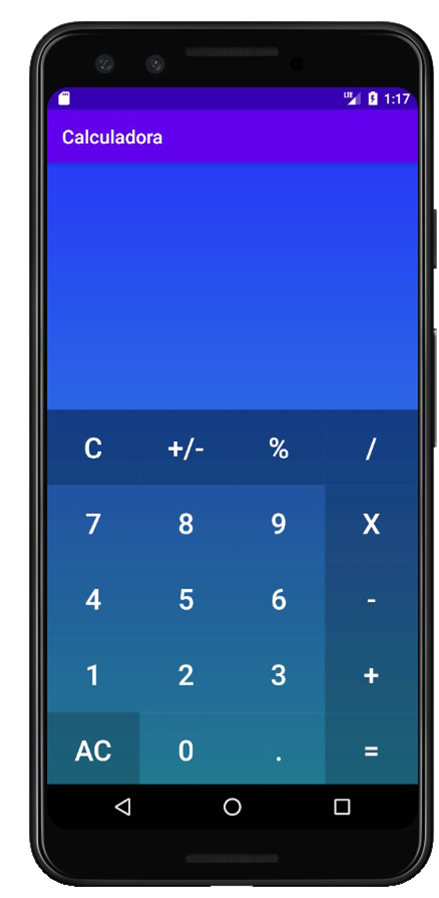
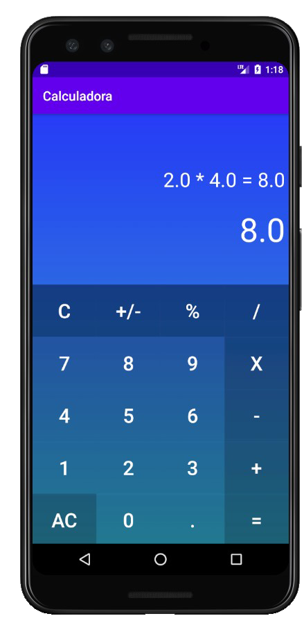

# Calculadora Android

## Descripción
Proyecto Android, creación de una calculadora que es capaz de realizar las siguientes funciones:
- sumar, restar, multiplicar, dividir.
- Calcular porcentaje. (Ej: 5 % x 50 = 2.5)
- Cambiar el signo. (+/-)
- Añadir decimales. (.)
- Borrar (C) y borrar todo (AC).

## Creado con
- [Android Studio](https://developer.android.com/studio)
- [Java](https://www.java.com/es/download/)

## Capturas de pantalla

## Autores
- Alejandro Cea
